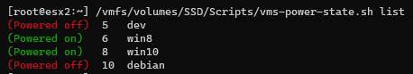
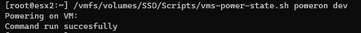
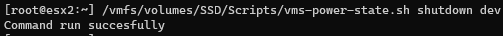
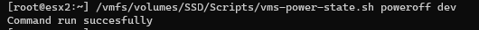

**Scripts and utilities for VMWare**
--------------------------------------

*   `vms-power-state.sh` Facilitates the powering on and off of virtual machines
*   ...

## vms-power-state

This bash script simplifies the powering on and off of VM via the command line.

### **Overview**

The script offers several commands to interact with VMs:

*   `vms-power-state.sh` Prints help text, providing an overview of available commands.
*   `vms-power-state.sh list` Displays a list of VMs along with their powering states.
*   `vms-power-state.sh <poweron|shutdown|poweroff> <VM_NAME|ALL>`:
    *   `poweron` Powers on the specified VM or all VMs.
    *   `shutdown` Initiates a graceful shutdown of the guest OS of the specified VM or all VMs.
    *   `poweroff` Immediately powers off the specified VM.

### **Usage Examples**

Let's walk through some usage examples of the script:

*   **Listing VMs and Powering States:**  
    Running `vms-power-state.sh list` provides a clear overview of all VMs and their current powering states, making it easy to identify which VMs are powered on or off.

*   **Powering On a VM:**  
    To power on a VM, simply run `vms-power-state.sh on <VM_NAME|ALL>`.

*   **Gracefully Shutting Down a VM:**  
    To initiate a graceful shutdown to perform a clean shutdown of a VM's guest OS, use `vms-power-state.sh shutdown <VM_NAME|ALL>`.

*   **Powering Off a VM:**  
    To power off immediately a VM, use `vms-power-state.sh shutdown <VM_NAME>`.

## ... (more tools to come)
